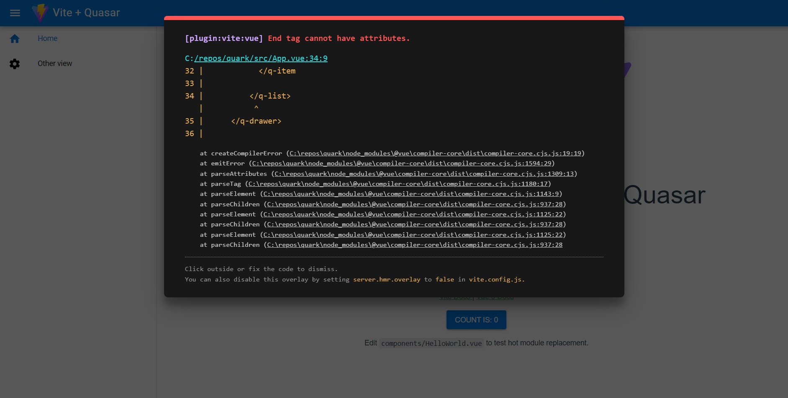
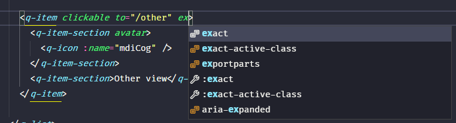

# Quark - Yet Another Vite Template

Quark is a YAVT - Yet Another Vite Template. I use it to build CSR (Client Side Rendered) apps that communicate with backend server with API calls to fetch and manipulate data. Since I am a Vue 3 + Quasar + TypeScript lover with an Airbnb ESlint config, I created this template to shorten creation time for my next projects.

## Features
* **ESLint + Vite** - thanks to [vite-plugin-eslint](https://github.com/gxmari007/vite-plugin-eslint) you'll get nice and clean errors, when you type something wrong:

* **Quasar autocomplete** - thanks to Quasar TS support, you'll get quasar autocomplete for quasar components:

* **Airbnb config with TS** - maybe you'll like it, maybe not, but I like it. It helps me a lot *to tame* my code during development.
* **@ path in project** - It's easier for me, to use `@` as an alias for `src/` directory.

Combining this packages and features was tricky for me (with a lot of searching), so maybe I'll shorten someone's path with this prepared configuration 😉

## Additional packages
I have some additional packages that helps with my projects, but you can delete them from `package.json` if you dan't want them:
* [Axios](https://axios-http.com) - to make API calls
* [Loadash](https://lodash.com) - Utility library
* [Pinia](https://pinia.vuejs.org) - Vue store

## How to use it
Just download (or clone and download) this repo, go to project directory and type:
```shell
npm install
```
Thats all! Enjoy quasar autocompletion, TS ESlint support and fast development/build thanks to Vite!

## That's it!
And it's all! Thank you for your time.
